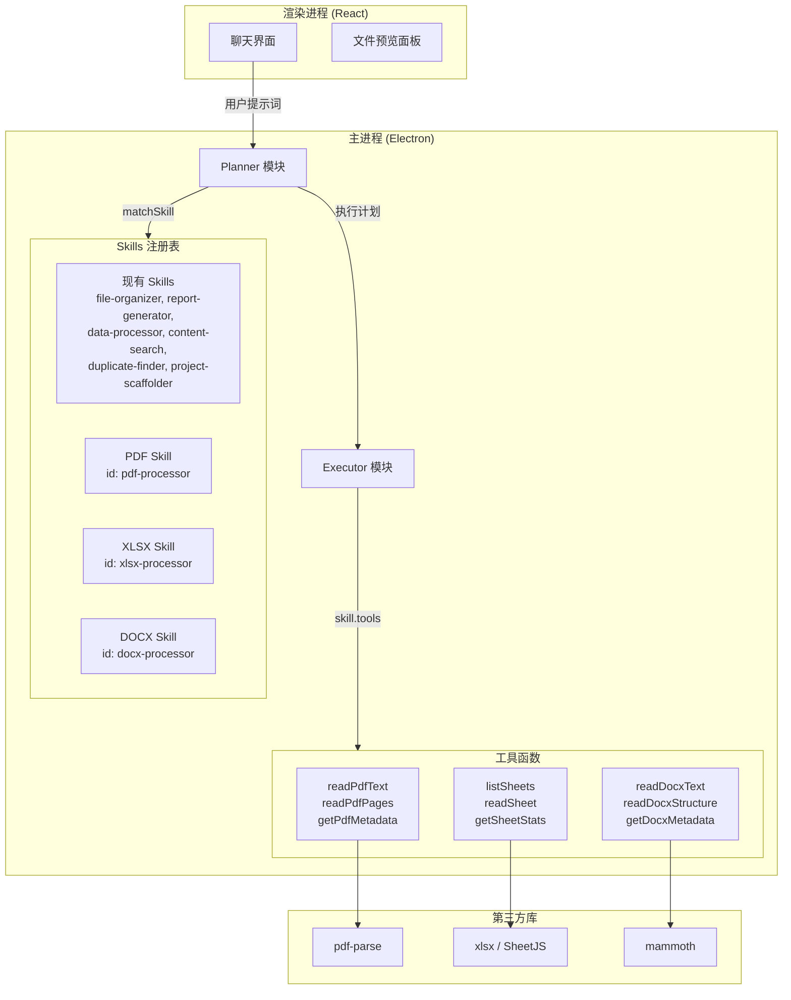
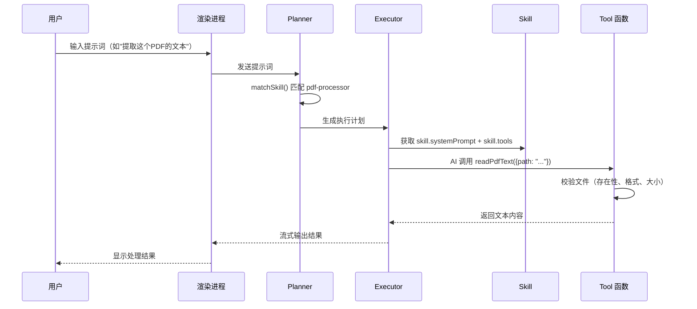

# 设计文档：内置文件处理 Skills（PDF、XLSX、DOCX）

## 概述

本设计为 FileWork 应用新增三个内置文件处理 Skills：PDF Skill、XLSX Skill 和 DOCX Skill。每个 Skill 遵循现有的 `Skill` 接口，通过 `tools` 字段提供格式专用的工具函数（基于 Vercel AI SDK `Tool` 类型 + Zod schema），通过 `systemPrompt` 指导 AI 的处理策略。

新增的三个 Skill 将注册到现有的 `skills` 数组中，与 Planner 和 Executor 无缝集成。工具函数在 Electron 主进程中运行，可直接访问文件系统，使用第三方 Node.js 库解析文件格式。

### 设计决策

1. **每种格式独立 Skill**：PDF、XLSX、DOCX 各自独立，关键词不重叠，确保 `matchSkill` 精准匹配
2. **工具函数在主进程执行**：文件解析在 Electron 主进程中完成，利用 Node.js 生态的成熟库
3. **统一的错误处理模式**：所有工具函数遵循相同的错误返回格式（`{ error: string }`）
4. **50MB 文件大小限制**：防止大文件导致内存溢出，所有工具函数在解析前检查文件大小
5. **与现有 data-processor 共存**：新 Skill 的关键词更具体（如 "pdf"、"docx"），避免与 data-processor 的通用关键词冲突

## 架构

### 系统架构图



### 执行流程



## 组件与接口

### 文件结构

```
src/main/skills/
├── types.ts                  # 现有 Skill 接口（不修改）
├── index.ts                  # Skills 注册表（新增三个 Skill 的导入和注册）
├── pdf-processor.ts          # 新增：PDF Skill 定义 + 工具函数
├── xlsx-processor.ts         # 新增：XLSX Skill 定义 + 工具函数
├── docx-processor.ts         # 新增：DOCX Skill 定义 + 工具函数
├── file-skill-utils.ts       # 新增：共享的文件校验工具函数
├── content-search.ts         # 现有
├── data-processor.ts         # 现有
├── duplicate-finder.ts       # 现有
├── file-organizer.ts         # 现有
├── project-scaffolder.ts     # 现有
└── report-generator.ts       # 现有
```

### 共享工具函数：`file-skill-utils.ts`

三个 Skill 的工具函数共享相同的文件校验逻辑，提取为公共模块：

```typescript
import { stat, access } from "node:fs/promises";
import { extname } from "node:path";

const MAX_FILE_SIZE = 50 * 1024 * 1024; // 50MB

export interface FileValidationResult {
  valid: boolean;
  error?: string;
  size?: number;
}

/**
 * 校验文件：存在性、扩展名、大小限制
 */
export const validateFile = async (
  filePath: string,
  allowedExtensions: string[],
): Promise<FileValidationResult> => {
  try {
    await access(filePath);
  } catch {
    return { valid: false, error: `文件不存在: ${filePath}` };
  }

  const ext = extname(filePath).toLowerCase();
  if (!allowedExtensions.includes(ext)) {
    return {
      valid: false,
      error: `不支持的文件格式: ${ext}，支持的格式: ${allowedExtensions.join(", ")}`,
    };
  }

  const stats = await stat(filePath);
  if (stats.size > MAX_FILE_SIZE) {
    return {
      valid: false,
      error: `文件过大 (${(stats.size / 1024 / 1024).toFixed(1)}MB)，最大支持 50MB`,
    };
  }

  return { valid: true, size: stats.size };
};
```

### PDF Skill：`pdf-processor.ts`

**第三方库**：`pdf-parse`（纯 JavaScript PDF 解析器，无需原生依赖，适合 Electron 环境）

**工具函数接口**：

| 工具名 | 输入参数 | 返回值 | 说明 |
|--------|---------|--------|------|
| `readPdfText` | `{ path: string }` | `{ text: string, pages: number }` | 提取 PDF 全文文本 |
| `readPdfPages` | `{ path: string, startPage?: number, endPage?: number }` | `{ pages: Array<{ page: number, text: string }> }` | 按页提取文本 |
| `getPdfMetadata` | `{ path: string }` | `{ title, author, pages, createdAt }` | 读取 PDF 元数据 |

**工具函数定义模式**（遵循 `duplicate-finder.ts` 中的模式）：

```typescript
import { z } from "zod/v4";
import type { Tool } from "ai";
import pdfParse from "pdf-parse";
import { readFile } from "node:fs/promises";
import { validateFile } from "./file-skill-utils";

const PDF_EXTENSIONS = [".pdf"];

const readPdfTextTool: Tool = {
  description: "读取 PDF 文件的全部文本内容",
  inputSchema: z.object({
    path: z.string().describe("PDF 文件的绝对路径"),
  }),
  execute: async ({ path }: { path: string }) => {
    const validation = await validateFile(path, PDF_EXTENSIONS);
    if (!validation.valid) return { error: validation.error };

    const buffer = await readFile(path);
    const data = await pdfParse(buffer);
    return { text: data.text, pages: data.numpages };
  },
};
```

### XLSX Skill：`xlsx-processor.ts`

**第三方库**：`xlsx`（SheetJS，纯 JavaScript 实现，支持 .xlsx 和 .xls 格式）

**工具函数接口**：

| 工具名 | 输入参数 | 返回值 | 说明 |
|--------|---------|--------|------|
| `listSheets` | `{ path: string }` | `{ sheets: string[] }` | 列出所有工作表名称 |
| `readSheet` | `{ path: string, sheet?: string }` | `{ data: object[], totalRows: number, truncated: boolean }` | 读取工作表数据（JSON 数组，超过 1000 行截断） |
| `getSheetStats` | `{ path: string, sheet?: string }` | `{ rows, columns, columnNames }` | 工作表统计信息 |

**截断逻辑**：`readSheet` 在行数超过 1000 时仅返回前 1000 行，并在返回结果中包含 `totalRows` 和 `truncated: true`。

### DOCX Skill：`docx-processor.ts`

**第三方库**：`mammoth`（专注于 .docx 转换，提取文本和结构信息，纯 JavaScript 实现）

**工具函数接口**：

| 工具名 | 输入参数 | 返回值 | 说明 |
|--------|---------|--------|------|
| `readDocxText` | `{ path: string }` | `{ text: string }` | 提取文档纯文本 |
| `readDocxStructure` | `{ path: string }` | `{ paragraphs: Array<{ text, style }> }` | 文档结构（标题层级 + 段落） |
| `getDocxMetadata` | `{ path: string }` | `{ title, author, createdAt, modifiedAt, paragraphs, words }` | 文档元数据 |

### Skills 注册表更新：`index.ts`

在现有 `skills` 数组中新增三个 Skill：

```typescript
import { pdfProcessor } from "./pdf-processor";
import { xlsxProcessor } from "./xlsx-processor";
import { docxProcessor } from "./docx-processor";

export const skills: Skill[] = [
  fileOrganizer,
  reportGenerator,
  dataProcessor,
  contentSearch,
  duplicateFinder,
  projectScaffolder,
  pdfProcessor,    // 新增
  xlsxProcessor,   // 新增
  docxProcessor,   // 新增
];
```

### 关键词设计与冲突避免

现有 `data-processor` 的关键词包含 `"excel"`, `"xlsx"`, `"数据"`, `"表格"` 等。为避免冲突：

- **PDF Skill 关键词**：`["pdf", "PDF", "pdf文件", "提取pdf", "pdf提取", "pdf文本", "pdf页面", "pdf元数据", "extract pdf", "pdf text", "pdf page", "pdf metadata"]`
  - 以 "pdf" 为核心，不与其他 Skill 重叠
- **XLSX Skill 关键词**：`["xlsx", "xls", "xlsx文件", "excel文件", "excel表格", "工作表", "spreadsheet", "sheet", "excel数据", "读取excel", "read excel", "excel sheet"]`
  - 使用更具体的组合词（如 "excel文件"、"excel表格"），比 data-processor 的单字 "excel" 更长，在评分中获得更高权重
- **DOCX Skill 关键词**：`["docx", "doc", "docx文件", "word文件", "word文档", "word段落", "word结构", "document text", "read word", "word content", "paragraph"]`
  - 以 "docx"/"word" 为核心

**评分机制分析**：`matchSkill` 按关键词字符长度 + 多关键词命中奖励评分。当用户输入 "读取这个 excel 文件的数据" 时：
- `data-processor` 匹配 "excel"(5) + "数据"(2) + "解析"(0) = 7 + 3(多命中奖励) = 10
- `xlsx-processor` 匹配 "excel文件"(7) + "excel数据"(7) = 14 + 3 = 17 ✅ 胜出

## 数据模型

### 工具函数返回值类型

```typescript
// PDF 工具返回类型
interface PdfTextResult {
  text: string;
  pages: number;
}

interface PdfPageResult {
  pages: Array<{
    page: number;
    text: string;
  }>;
}

interface PdfMetadataResult {
  title: string | null;
  author: string | null;
  pages: number;
  createdAt: string | null;
}

// XLSX 工具返回类型
interface SheetListResult {
  sheets: string[];
}

interface SheetDataResult {
  data: Record<string, unknown>[];
  totalRows: number;
  truncated: boolean;
  truncatedMessage?: string;
}

interface SheetStatsResult {
  rows: number;
  columns: number;
  columnNames: string[];
}

// DOCX 工具返回类型
interface DocxTextResult {
  text: string;
}

interface DocxStructureResult {
  paragraphs: Array<{
    text: string;
    style: string; // "Heading1" | "Heading2" | ... | "Normal" | etc.
  }>;
}

interface DocxMetadataResult {
  title: string | null;
  author: string | null;
  createdAt: string | null;
  modifiedAt: string | null;
  paragraphs: number;
  words: number;
}

// 通用错误返回
interface ToolError {
  error: string;
}
```

### 第三方库依赖

| 库名 | 版本 | 用途 | 大小 | 原生依赖 |
|------|------|------|------|---------|
| `pdf-parse` | ^1.1.1 | PDF 文本提取和元数据读取 | ~100KB | 无 |
| `xlsx` | ^0.18.5 | Excel 文件读写（SheetJS） | ~1MB | 无 |
| `mammoth` | ^1.8.0 | DOCX 文本和结构提取 | ~200KB | 无 |

所有库均为纯 JavaScript 实现，无需 `electron-rebuild`，不影响现有构建流程。

需要安装对应的类型声明包（如果库本身不包含）：
- `@types/pdf-parse`（pdf-parse 不含类型声明）
- `xlsx` 和 `mammoth` 自带类型声明

## 正确性属性

*属性（Property）是指在系统所有有效执行中都应成立的特征或行为——本质上是对系统应做什么的形式化陈述。属性是人类可读规格说明与机器可验证正确性保证之间的桥梁。*

### Property 1: 无效文件路径统一返回错误

*For any* 工具函数（跨 PDF、XLSX、DOCX 三个 Skill 的所有 9 个工具函数），给定一个不存在的文件路径，工具函数应返回包含 `error` 字段的结果，且不抛出异常。

**Validates: Requirements 2.4, 4.4, 6.4**

### Property 2: 格式特定关键词正确路由到对应 Skill

*For any* 包含格式特定关键词（如 "pdf"、"xlsx"、"docx"、"word"、"excel"）的用户提示词，`matchSkill` 函数应返回对应的文件处理 Skill（而非 `data-processor` 或其他 Skill）。

**Validates: Requirements 7.1, 7.2**

### Property 3: systemPrompt 引用所有工具函数名称

*For any* 新增的文件处理 Skill（PDF、XLSX、DOCX），其 `systemPrompt` 字符串应包含该 Skill 的 `tools` 对象中定义的每一个工具函数名称。

**Validates: Requirements 8.3**

### Property 4: readSheet 超过 1000 行时截断

*For any* 包含超过 1000 行数据的工作表，`readSheet` 工具函数返回的 `data` 数组长度应恰好为 1000，`truncated` 应为 `true`，且 `totalRows` 应等于实际总行数。

**Validates: Requirements 4.6**

## 错误处理

### 错误分类与处理策略

| 错误类型 | 触发条件 | 处理方式 | 返回格式 |
|---------|---------|---------|---------|
| 文件不存在 | `access()` 抛出 ENOENT | 返回错误信息 | `{ error: "文件不存在: /path/to/file" }` |
| 格式不支持 | 文件扩展名不在允许列表中 | 返回错误信息 | `{ error: "不支持的文件格式: .txt，支持的格式: .pdf" }` |
| 文件过大 | 文件大小 > 50MB | 返回警告并拒绝 | `{ error: "文件过大 (52.3MB)，最大支持 50MB" }` |
| 解析失败 | 第三方库抛出异常（如损坏的 PDF） | 捕获异常，返回错误 | `{ error: "PDF 解析失败: [具体错误信息]" }` |
| 工作表不存在 | `readSheet` 指定的 sheet 名称不存在 | 返回错误信息 | `{ error: "工作表不存在: Sheet3，可用工作表: Sheet1, Sheet2" }` |

### 错误处理原则

1. **不抛出异常**：所有工具函数的 `execute` 方法内部捕获所有异常，统一返回 `{ error: string }` 格式
2. **错误信息本地化**：错误信息使用中文描述，与应用整体风格一致
3. **前置校验**：在调用第三方库之前先执行 `validateFile` 校验，避免不必要的文件读取
4. **优雅降级**：元数据字段缺失时返回 `null` 而非报错（如 PDF 没有设置作者）

## 测试策略

### 双重测试方法

本功能采用单元测试 + 属性测试的双重策略：

- **单元测试**：验证具体示例、边界情况和错误条件
- **属性测试**：验证跨所有输入的通用属性

### 属性测试配置

- **测试框架**：Vitest（项目已有）
- **属性测试库**：`fast-check`（与 Vitest 集成良好的 TypeScript 属性测试库）
- **每个属性测试最少运行 100 次迭代**
- **每个属性测试必须通过注释引用设计文档中的属性编号**
- **标签格式**：`Feature: builtin-file-skills, Property {number}: {property_text}`
- **每个正确性属性由单个属性测试实现**

### 单元测试范围

单元测试聚焦于以下场景（避免过多，属性测试覆盖通用输入）：

1. **Skill 结构验证**（需求 1.1, 3.1, 5.1）：验证三个 Skill 对象的 id、name、keywords、tools、suggestions 字段
2. **Skill 注册验证**（需求 1.4, 3.4, 5.4）：验证 `getSkill()` 和 `getAllSuggestions()` 包含新 Skill
3. **PDF 工具函数**（需求 2.1-2.3）：使用已知 PDF fixture 验证 `readPdfText`、`readPdfPages`、`getPdfMetadata` 的返回值
4. **XLSX 工具函数**（需求 4.1-4.3）：使用已知 XLSX fixture 验证 `listSheets`、`readSheet`、`getSheetStats` 的返回值
5. **DOCX 工具函数**（需求 6.1-6.3）：使用已知 DOCX fixture 验证 `readDocxText`、`readDocxStructure`、`getDocxMetadata` 的返回值
6. **文件大小限制**（需求 2.5, 4.5, 6.5）：模拟大文件场景验证拒绝处理

### 属性测试范围

每个正确性属性对应一个属性测试：

1. **Property 1 测试**：生成随机的不存在文件路径，对所有 9 个工具函数调用，验证均返回 `{ error: string }` 且不抛出异常
   - `Feature: builtin-file-skills, Property 1: 无效文件路径统一返回错误`

2. **Property 2 测试**：生成包含格式特定关键词的随机提示词，验证 `matchSkill` 返回对应的 Skill
   - `Feature: builtin-file-skills, Property 2: 格式特定关键词正确路由到对应 Skill`

3. **Property 3 测试**：遍历三个新 Skill，验证每个 Skill 的 systemPrompt 包含其 tools 中的所有工具名称
   - `Feature: builtin-file-skills, Property 3: systemPrompt 引用所有工具函数名称`

4. **Property 4 测试**：生成包含超过 1000 行的随机 XLSX 数据，验证 `readSheet` 返回恰好 1000 行且 `truncated` 为 true
   - `Feature: builtin-file-skills, Property 4: readSheet 超过 1000 行时截断`

### 测试文件结构

```
src/main/skills/__tests__/
├── pdf-processor.test.ts      # PDF Skill 单元测试
├── xlsx-processor.test.ts     # XLSX Skill 单元测试
├── docx-processor.test.ts     # DOCX Skill 单元测试
├── file-skill-utils.test.ts   # 共享校验函数单元测试
├── skills-registry.test.ts    # Skill 注册和匹配测试
└── file-skills.property.test.ts  # 所有属性测试
```

### 测试 Fixture

在 `src/main/skills/__tests__/fixtures/` 目录下准备：
- `sample.pdf`：包含已知文本和元数据的 PDF 文件
- `sample.xlsx`：包含多个工作表、已知数据的 Excel 文件
- `sample.docx`：包含标题层级和段落的 Word 文档
