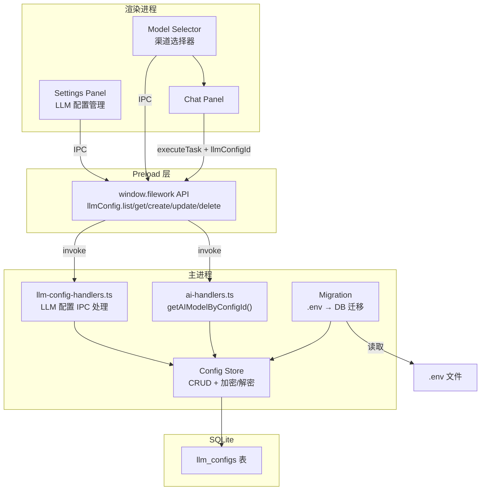
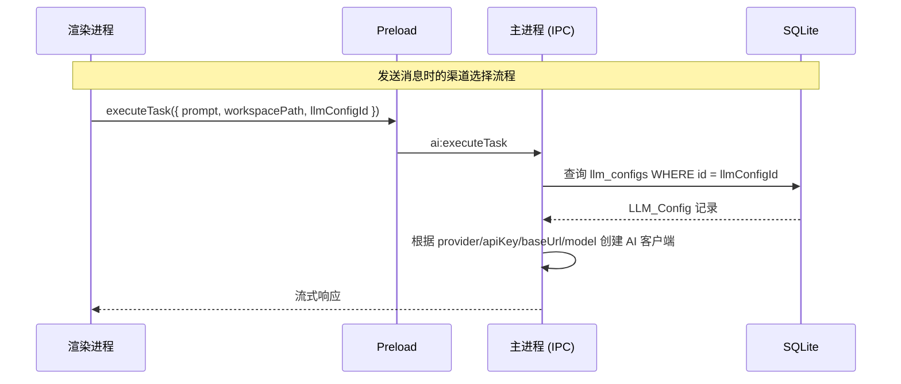

# 技术设计文档：多 LLM 渠道配置管理

## 概述

本设计将应用的 LLM 配置从 `.env` 文件硬编码方式迁移到数据库持久化管理，支持用户在设置界面中管理多个 LLM 渠道配置，并在聊天面板中动态选择使用哪个渠道。

核心变更涉及四个层面：
1. 数据层：新增 `llm_configs` 数据库表，提供加密存储的 CRUD 操作
2. 主进程 IPC 层：新增 LLM 配置管理的 IPC 通道，重构 `getAIModel` 为基于配置 ID 的动态路由
3. Preload 层：暴露 LLM 配置管理 API 到渲染进程
4. 渲染进程：设置面板新增配置管理 UI，聊天面板新增 Model Selector 组件

## 架构

### 系统架构图



### 数据流



### 设计决策

1. **新建独立 IPC handler 文件**：LLM 配置管理逻辑放在 `src/main/ipc/llm-config-handlers.ts`，与现有 `settings-handlers.ts` 分离，避免职责混杂。

2. **API Key 加密方案**：使用 Node.js `crypto` 模块的 AES-256-GCM 对称加密。密钥派生自 Electron `app.getPath('userData')` 路径 + 固定盐值的 PBKDF2 哈希，确保每台机器的密钥不同。这是一个合理的折中方案——不依赖系统 keychain（跨平台兼容性更好），同时避免明文存储。

3. **`getAIModel` 重构策略**：将现有的 `getAIModel()` 无参函数改为 `getAIModelByConfigId(configId?: string)`，接受可选的配置 ID。未传 ID 时使用默认配置。这样对现有调用点（planner 等）的改动最小。

4. **Model Selector 会话级状态**：选中的 LLM 配置 ID 存储在 `useChatSession` hook 的 state 中，不持久化到数据库。切换会话时重置为默认配置，符合需求 3.6。

## 组件与接口

### 1. Config Store（数据访问层）

文件：`src/main/db/index.ts`（扩展现有模块）

```typescript
// 新增导出函数
export function createLlmConfig(config: Omit<LlmConfig, 'id' | 'createdAt' | 'updatedAt'>): LlmConfig;
export function getLlmConfigs(): LlmConfig[];
export function getLlmConfig(id: string): LlmConfig | null;
export function updateLlmConfig(id: string, updates: Partial<Omit<LlmConfig, 'id' | 'createdAt'>>): void;
export function deleteLlmConfig(id: string): void;
export function getDefaultLlmConfig(): LlmConfig | null;
export function setDefaultLlmConfig(id: string): void;
export function migrateLlmConfigFromEnv(): void;
```

API Key 在写入时加密、读取时解密，对调用方透明。

### 2. 加密工具模块

文件：`src/main/db/crypto.ts`（新建）

```typescript
export function encrypt(plaintext: string): string;   // 返回 "iv:authTag:ciphertext" 格式
export function decrypt(encrypted: string): string;
```

使用 AES-256-GCM，密钥通过 PBKDF2 从机器特定种子派生。

### 3. LLM Config IPC Handlers

文件：`src/main/ipc/llm-config-handlers.ts`（新建）

```typescript
export function registerLlmConfigHandlers(): void;
// 注册以下 IPC 通道：
// - llm-config:list    → getLlmConfigs()
// - llm-config:get     → getLlmConfig(id)
// - llm-config:create  → createLlmConfig(data)
// - llm-config:update  → updateLlmConfig(id, data)
// - llm-config:delete  → deleteLlmConfig(id)
```

### 4. AI Handler 重构

文件：`src/main/ipc/ai-handlers.ts`（修改）

```typescript
// 替换现有 getAIModel
function getAIModelByConfigId(configId?: string): LanguageModel;
// 内部逻辑：
// 1. configId 存在 → 从 DB 查询配置
// 2. configId 不存在 → 查询默认配置
// 3. 配置不存在 → 抛出错误
// 4. 根据 provider 类型创建对应 AI SDK 实例
```

`executeTask` 和 `generatePlan` 的 payload 新增可选 `llmConfigId` 字段。

### 5. Preload 层扩展

文件：`src/preload/index.ts`（修改）

```typescript
// 在 api 对象中新增：
llmConfig: {
  list: () => ipcRenderer.invoke('llm-config:list'),
  get: (id: string) => ipcRenderer.invoke('llm-config:get', { id }),
  create: (data: CreateLlmConfigPayload) => ipcRenderer.invoke('llm-config:create', data),
  update: (id: string, data: UpdateLlmConfigPayload) => ipcRenderer.invoke('llm-config:update', { id, ...data }),
  delete: (id: string) => ipcRenderer.invoke('llm-config:delete', { id }),
},

// 修改现有方法签名：
executeTask: (payload: { prompt: string; workspacePath: string; llmConfigId?: string }) => ...,
generatePlan: (payload: { prompt: string; workspacePath: string; llmConfigId?: string }) => ...,
```

### 6. Settings Panel - LLM 配置管理组件

文件：`src/renderer/components/settings/LlmConfigPanel.tsx`（新建）

职责：
- 展示 LLM 配置列表（名称、Provider、模型）
- 添加/编辑配置的表单对话框
- 根据 Provider 类型动态调整表单字段
- 删除确认对话框
- 默认配置切换
- 表单验证（必填字段校验）

### 7. Model Selector 组件

文件：`src/renderer/components/chat/ModelSelector.tsx`（新建）

职责：
- 下拉菜单展示所有可用 LLM 配置
- 显示配置的显示名称和模型名称
- 默认选中标记为默认的配置
- 仅在多条配置时显示，单条时隐藏
- 选择状态通过 props/callback 传递给 ChatPanel

### 8. i18n 扩展

在 `zh-CN/index.ts`、`en/index.ts`、`ja/index.ts` 中新增 LLM 配置管理相关的翻译键：

```typescript
// 新增键示例
llmConfig_title: "LLM 渠道配置",
llmConfig_add: "添加配置",
llmConfig_edit: "编辑",
llmConfig_delete: "删除",
llmConfig_name: "显示名称",
llmConfig_provider: "服务商",
llmConfig_apiKey: "API 密钥",
llmConfig_baseUrl: "Base URL",
llmConfig_model: "模型",
llmConfig_default: "默认",
llmConfig_setDefault: "设为默认",
llmConfig_deleteConfirm: "确定要删除此配置吗？",
llmConfig_deleteLastError: "至少保留一条默认配置",
llmConfig_validationRequired: "此字段为必填项",
llmConfig_authError: "API Key 无效或已过期，请在设置中检查该渠道配置",
llmConfig_notFound: "所选 LLM 配置不存在",
```

## 数据模型

### llm_configs 表

```sql
CREATE TABLE IF NOT EXISTS llm_configs (
  id TEXT PRIMARY KEY,
  name TEXT NOT NULL,
  provider TEXT NOT NULL CHECK(provider IN ('openai','anthropic','deepseek','ollama','custom')),
  api_key TEXT,           -- AES-256-GCM 加密存储
  base_url TEXT,
  model TEXT NOT NULL,
  is_default INTEGER NOT NULL DEFAULT 0,
  created_at TEXT NOT NULL,
  updated_at TEXT NOT NULL
);
```

### Drizzle Schema 定义

文件：`src/main/db/schema.ts`（扩展）

```typescript
export const llmConfigs = sqliteTable("llm_configs", {
  id: text("id").primaryKey(),
  name: text("name").notNull(),
  provider: text("provider", {
    enum: ["openai", "anthropic", "deepseek", "ollama", "custom"],
  }).notNull(),
  apiKey: text("api_key"),          // 加密存储
  baseUrl: text("base_url"),
  model: text("model").notNull(),
  isDefault: integer("is_default", { mode: "boolean" }).notNull().default(false),
  createdAt: text("created_at").notNull(),
  updatedAt: text("updated_at").notNull(),
});
```

### TypeScript 接口

```typescript
interface LlmConfig {
  id: string;
  name: string;
  provider: "openai" | "anthropic" | "deepseek" | "ollama" | "custom";
  apiKey: string | null;
  baseUrl: string | null;
  model: string;
  isDefault: boolean;
  createdAt: string;
  updatedAt: string;
}

// Preload 层传输类型（不含时间戳）
interface CreateLlmConfigPayload {
  name: string;
  provider: LlmConfig["provider"];
  apiKey?: string;
  baseUrl?: string;
  model: string;
  isDefault?: boolean;
}

interface UpdateLlmConfigPayload {
  name?: string;
  provider?: LlmConfig["provider"];
  apiKey?: string;
  baseUrl?: string;
  model?: string;
  isDefault?: boolean;
}
```

### Provider 字段规则

| Provider   | API Key | Base URL | 说明 |
|-----------|---------|----------|------|
| openai    | 必填    | 可选     | 默认使用 OpenAI 官方端点 |
| anthropic | 必填    | 可选     | 默认使用 Anthropic 官方端点 |
| deepseek  | 必填    | 可选     | 默认使用 DeepSeek 官方端点 |
| ollama    | 不需要  | 必填     | 本地部署，默认 http://localhost:11434 |
| custom    | 可选    | 必填     | OpenAI 兼容端点 |

### .env 迁移映射

| .env 变量 | 映射到 LlmConfig 字段 |
|-----------|----------------------|
| AI_PROVIDER | provider |
| AI_MODEL | model |
| OPENAI_API_KEY | apiKey (当 provider=openai) |
| OPENAI_BASE_URL / CUSTOM_BASE_URL | baseUrl |
| ANTHROPIC_API_KEY | apiKey (当 provider=anthropic) |
| ANTHROPIC_BASE_URL | baseUrl (当 provider=anthropic) |
| DEEPSEEK_API_KEY | apiKey (当 provider=deepseek) |
| OLLAMA_BASE_URL | baseUrl (当 provider=ollama) |


## 正确性属性（Correctness Properties）

*属性是一种在系统所有有效执行中都应成立的特征或行为——本质上是关于系统应该做什么的形式化陈述。属性是人类可读规格说明与机器可验证正确性保证之间的桥梁。*

### Property 1: LLM 配置 CRUD 往返一致性

*For any* 有效的 LLM 配置数据（包含名称、Provider 类型、API Key、Base URL、模型名称），创建该配置后通过 ID 读取，返回的记录应包含所有原始字段值且 ID 为非空唯一字符串。

**Validates: Requirements 1.1, 1.2**

### Property 2: 更新操作保留变更

*For any* 已存在的 LLM 配置和任意有效的字段更新集合，执行更新后重新读取该配置，被更新的字段应反映新值，未更新的字段应保持原值。

**Validates: Requirements 1.3**

### Property 3: 删除操作移除记录

*For any* 已存在的 LLM 配置，执行删除后通过该 ID 查询应返回 null，且配置列表中不再包含该记录。

**Validates: Requirements 1.4**

### Property 4: API Key 加密往返一致性

*For any* 非空字符串作为 API Key，加密后再解密应返回与原始值完全相同的字符串；且加密后的密文不应等于原始明文。

**Validates: Requirements 1.6**

### Property 5: Provider 字段验证规则

*For any* Provider 类型和任意配置输入，验证函数应正确识别缺失的必填字段：openai/anthropic/deepseek 要求 API Key 必填；ollama/custom 要求 Base URL 必填；所有 Provider 要求名称和模型必填。当必填字段缺失时验证应失败，当所有必填字段存在时验证应通过。

**Validates: Requirements 2.3, 2.5**

### Property 6: 默认配置唯一性不变量

*For any* 包含一条或多条 LLM 配置的集合，执行 setDefault 操作后，数据库中恰好有且仅有一条配置的 isDefault 为 true。

**Validates: Requirements 2.9**

### Property 7: 默认配置解析

*For any* 包含至少一条 LLM 配置的集合（其中恰好一条标记为默认），调用 getDefaultLlmConfig 应返回该标记为默认的配置；当 AI Handler 未收到 configId 参数时，应使用该默认配置。

**Validates: Requirements 3.3, 4.2**

### Property 8: 配置驱动的 AI 客户端路由

*For any* 有效的 LLM 配置，getAIModelByConfigId 应根据配置的 provider 字段创建对应类型的 AI SDK 实例（openai → createOpenAI, anthropic → createAnthropic, deepseek → createDeepSeek），并使用配置中的 apiKey、baseUrl 和 model 参数。

**Validates: Requirements 4.1**

### Property 9: 自定义端点使用 Chat Completions API

*For any* LLM 配置，当 provider 为 "custom" 或 baseUrl 不包含 "api.openai.com" 时，应使用 openai.chat(modelId) 而非 openai(modelId)；当 provider 为 "openai" 且 baseUrl 包含 "api.openai.com" 或为空时，应使用 openai(modelId)。

**Validates: Requirements 4.4**

### Property 10: 数据库配置优先于环境变量

*For any* 状态下，当数据库中已存在 LLM 配置记录时，AI Handler 应使用数据库中的配置而忽略 .env 中的环境变量值。

**Validates: Requirements 6.2**

## 错误处理

### 数据层错误

| 场景 | 处理方式 |
|------|---------|
| 创建配置时 DB 写入失败 | 抛出异常，IPC handler 捕获并返回 `{ error: string }` |
| 删除唯一默认配置 | Config Store 层拒绝操作，返回错误信息 |
| 迁移时 .env 不存在或字段为空 | 创建 openai/gpt-4o-mini 默认配置 |
| 加密/解密失败 | 记录日志，API Key 字段返回空字符串 |

### AI 请求错误

| 场景 | 处理方式 |
|------|---------|
| configId 对应的配置不存在 | 返回错误 "所选 LLM 配置不存在" |
| API Key 无效（401/403） | 捕获认证错误，返回 "API Key 无效或已过期，请在设置中检查该渠道配置" |
| 网络超时/连接失败 | 保持现有错误处理逻辑，通过 `ai:stream-error` 通知渲染进程 |

### 表单验证错误

| 场景 | 处理方式 |
|------|---------|
| 必填字段为空 | 在对应字段旁显示红色提示文本 |
| Provider 切换后字段不匹配 | 清空不适用的字段，重新验证 |

## 测试策略

### 属性测试（Property-Based Testing）

使用 [fast-check](https://github.com/dubzzz/fast-check) 库进行属性测试，每个属性测试至少运行 100 次迭代。

每个测试必须通过注释引用设计文档中的属性编号：
```typescript
// Feature: multi-llm-settings, Property 1: LLM 配置 CRUD 往返一致性
```

属性测试覆盖范围：
- Property 1-3: Config Store 的 CRUD 操作（使用内存 SQLite 数据库）
- Property 4: 加密模块的往返一致性
- Property 5: 验证函数的字段规则
- Property 6: setDefault 操作的唯一性不变量
- Property 7: getDefaultLlmConfig 的解析逻辑
- Property 8-9: AI 客户端路由逻辑（mock AI SDK 工厂函数）
- Property 10: 数据库优先级逻辑

生成器策略：
- LLM 配置生成器：随机生成有效的 provider、name、model、apiKey、baseUrl 组合
- 更新操作生成器：随机选择要更新的字段子集和新值
- Provider 生成器：从 ["openai", "anthropic", "deepseek", "ollama", "custom"] 中随机选择

### 单元测试

单元测试聚焦于具体示例和边界情况：

- .env 迁移：验证各种 .env 配置组合的迁移结果（需求 6.1, 6.3）
- 迁移回退：.env 不存在时创建 openai/gpt-4o-mini 默认配置
- 删除保护：尝试删除唯一默认配置时应被拒绝（需求 2.8）
- 不存在的 configId：AI Handler 应返回明确错误（需求 4.3）
- 认证失败错误映射：401/403 错误应转换为用户友好的提示（需求 4.5）
- IPC 通道注册：验证所有 5 个 llm-config 通道已注册（需求 5.1）

### 测试工具

- 测试框架：Vitest（与项目现有配置一致）
- 属性测试库：fast-check
- 数据库测试：使用 better-sqlite3 内存模式 (`:memory:`)
- Mock：使用 Vitest 的 `vi.mock` 模拟 AI SDK 工厂函数和 Electron IPC
