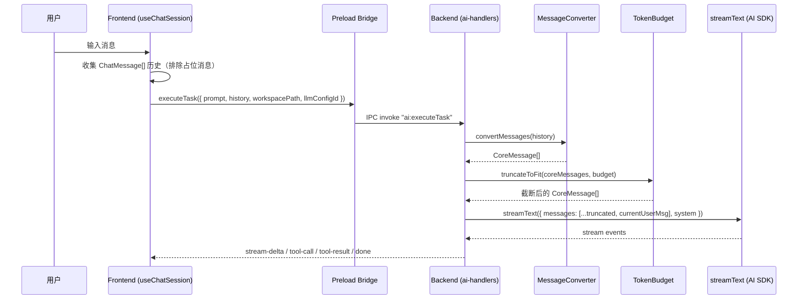

# 技术设计文档：多轮对话上下文

## 概述

本设计为 FileWork 实现多轮对话上下文传递能力。当前架构中，前端 `useChatSession` 在每次调用 `executeTask` 时仅传递当前 prompt，后端使用 `streamText({ prompt })` 进行单轮调用。本设计将：

1. 前端在 IPC 调用中附带完整对话历史（`ChatMessage[]`）
2. 后端新增 `MessageConverter` 模块，将 `ChatMessage[]` 转换为 Vercel AI SDK 的 `CoreMessage[]`
3. 后端在有历史时切换为 `streamText({ messages })` 模式
4. 引入 token 预算控制，防止长对话超出模型上下文窗口
5. Fork 模式技能（如 agent-browser）同样获得对话历史上下文

核心设计原则：向后兼容——`history` 为可选字段，缺失时行为与修改前完全一致。

## 架构

### 数据流架构图



### 模块关系图

```mermaid
graph TB
    subgraph Renderer["渲染进程"]
        CS[useChatSession.ts<br/>收集 history]
    end

    subgraph Preload["Preload 层"]
        PB["executeTask payload<br/>新增 history 字段"]
    end

    subgraph Main["主进程"]
        AH["ai-handlers.ts<br/>路由 prompt/messages 模式"]
        MC["message-converter.ts<br/>ChatMessage → CoreMessage"]
        TB["token-budget.ts<br/>截断 + 压缩"]
        EX["executor.ts<br/>fork 模式上下文传递"]
    end

    CS -->|history: ChatMessage[]| PB
    PB -->|IPC| AH
    AH --> MC
    AH --> TB
    AH -->|fork 模式| EX
    EX --> MC
    EX --> TB
```

## 组件与接口

### 1. IPC Payload 扩展

`ai:executeTask` 的 payload 类型扩展：

```typescript
// 修改前
interface ExecuteTaskPayload {
  prompt: string;
  workspacePath: string;
  llmConfigId?: string;
}

// 修改后
interface ExecuteTaskPayload {
  prompt: string;
  workspacePath: string;
  llmConfigId?: string;
  history?: HistoryMessage[];  // 新增，可选
}

// 传输用的精简消息类型（排除 sessionId、timestamp 等）
interface HistoryMessage {
  role: "user" | "assistant";
  content: string;
  parts?: MessagePart[];
}
```

### 2. MessageConverter 模块

新建 `src/main/ai/message-converter.ts`：

```typescript
import type { CoreMessage } from "ai";

interface HistoryMessage {
  role: "user" | "assistant";
  content: string;
  parts?: MessagePart[];
}

/**
 * 将前端 ChatMessage 历史转换为 Vercel AI SDK CoreMessage 数组。
 *
 * 转换规则：
 * - user 消息 → CoreMessage { role: "user", content: text }
 * - assistant 消息的 TextPart → CoreMessage { role: "assistant", content: [...text parts] }
 * - assistant 消息的 ToolPart → 拆分为 assistant tool-call + tool result 消息
 * - PlanMessagePart → 忽略
 * - ToolPart 缺少 result → 使用占位文本
 */
export function convertToCoreMessages(history: HistoryMessage[]): CoreMessage[];
```

转换逻辑详解：

对于每条 assistant 消息，遍历其 `parts` 数组：
- `TextPart` → 收集为 assistant 消息的 `text` content part
- `ToolPart` → 收集为 assistant 消息的 `tool-call` content part，同时生成一条独立的 `tool` 角色消息：
  ```typescript
  { role: "tool", content: [{ type: "tool-result", toolCallId, toolName, result }] }
  ```
- `PlanMessagePart` → 跳过
- 当 `ToolPart.result` 为 `undefined` 时，使用 `"[工具执行结果未记录]"` 作为 result

### 3. TokenBudget 模块

新建 `src/main/ai/token-budget.ts`：

```typescript
const DEFAULT_TOKEN_BUDGET = 80000;

interface TruncationResult {
  messages: CoreMessage[];
  wasTruncated: boolean;
}

/**
 * 将 CoreMessage 数组截断到 token 预算内。
 *
 * 策略（按优先级）：
 * 1. 压缩工具结果：将大型 tool-result 内容替换为摘要占位符
 * 2. 移除早期消息轮次：从最早的消息开始移除
 * 3. 截断后在开头插入系统提示
 *
 * Token 估算：字符数 / 4
 */
export function truncateToFit(
  messages: CoreMessage[],
  budget?: number,
): TruncationResult;

/**
 * 估算 CoreMessage 数组的 token 数量。
 */
export function estimateTokens(messages: CoreMessage[]): number;
```

### 4. 前端 history 收集

修改 `useChatSession.ts` 的 `handleSubmit`：

```typescript
// 在调用 executeTask 前，从 messages 中提取 history
const history: HistoryMessage[] = messages
  .filter(m => m.id !== assistantId)  // 排除当前占位消息
  .map(({ role, content, parts }) => ({
    role,
    content,
    parts: parts?.filter(p => p.type !== "plan"),  // 排除 PlanMessagePart
  }));

window.filework.executeTask({
  prompt: userMessage.content,
  workspacePath,
  llmConfigId: selectedLlmConfigId || undefined,
  history,
});
```

### 5. Fork 模式上下文传递

修改 `executor.ts` 的 `executeSubagent` 函数签名，通过 `ExecutionContext` 传递历史：

```typescript
interface ExecutionContext {
  // ... 现有字段
  history?: CoreMessage[];  // 新增：已转换的对话历史
}
```

`executeSubagent` 内部在有 history 时使用 `messages` 模式：

```typescript
const result = streamText({
  model,
  tools,
  system: `${systemPrompt}\n\nCurrent workspace: ${workspacePath}`,
  ...(ctx.history?.length
    ? { messages: [...ctx.history, { role: "user" as const, content: ctx.systemPrompt }] }
    : { prompt: ctx.systemPrompt }),
});
```

### 6. Preload Bridge 更新

修改 `src/preload/index.ts` 中 `executeTask` 的类型：

```typescript
executeTask: (payload: {
  prompt: string;
  workspacePath: string;
  llmConfigId?: string;
  history?: Array<{ role: "user" | "assistant"; content: string; parts?: unknown[] }>;
}) => ipcRenderer.invoke("ai:executeTask", payload),
```

## 数据模型

### HistoryMessage（IPC 传输格式）

| 字段 | 类型 | 说明 |
|------|------|------|
| role | `"user" \| "assistant"` | 消息角色 |
| content | `string` | 文本内容 |
| parts | `MessagePart[]?` | 可选，结构化消息部分 |

这是 `ChatMessage` 的精简版本，排除了 `id`、`sessionId`、`timestamp` 等非必要字段，以减少 IPC 传输体积。

### CoreMessage 映射关系

| ChatMessage 类型 | CoreMessage 输出 |
|-----------------|-----------------|
| `role: "user"` | `{ role: "user", content: text }` |
| `role: "assistant"` + TextPart | `{ role: "assistant", content: [{ type: "text", text }] }` |
| `role: "assistant"` + ToolPart | `{ role: "assistant", content: [{ type: "tool-call", ... }] }` + `{ role: "tool", content: [{ type: "tool-result", ... }] }` |
| PlanMessagePart | 忽略，不生成 CoreMessage |

### Token 预算配置

| 参数 | 默认值 | 说明 |
|------|--------|------|
| TOKEN_BUDGET | 80000 | 对话历史最大 token 数 |
| TOOL_RESULT_COMPRESS_THRESHOLD | 2000 | 工具结果超过此字符数时压缩 |
| TOKEN_ESTIMATE_RATIO | 4 | 字符数 / 此值 = 估算 token 数 |


## 正确性属性（Correctness Properties）

*属性（Property）是指在系统所有有效执行中都应成立的特征或行为——本质上是对系统应做什么的形式化陈述。属性是人类可读规格说明与机器可验证正确性保证之间的桥梁。*

### Property 1: 历史提取排除占位消息并精简字段

*For any* 消息列表和占位助手消息 ID，提取的 history 数组不应包含该占位消息，且每条 HistoryMessage 仅包含 `role`、`content`、`parts` 三个字段（不含 `id`、`sessionId`、`timestamp`）。

**Validates: Requirements 1.1, 1.4**

### Property 2: 消息转换文本保真性（Round-Trip）

*For any* 有效的 HistoryMessage 数组，经 `convertToCoreMessages` 转换后，从 CoreMessage 数组中提取所有文本内容，应与原始消息中的文本内容一致（顺序和内容均相同）。

**Validates: Requirements 2.1, 2.2, 2.6, 2.7**

### Property 3: ToolPart 结构正确性

*For any* 包含 ToolPart 的 assistant 消息，`convertToCoreMessages` 应生成：(a) 一条 assistant 角色消息包含对应的 `tool-call` 内容部分，以及 (b) 紧随其后的一条 `tool` 角色消息包含对应的 `tool-result`。当 ToolPart 缺少 `result` 时，tool-result 的内容应为占位文本 `"[工具执行结果未记录]"`。

**Validates: Requirements 2.3, 2.4**

### Property 4: PlanMessagePart 过滤

*For any* 包含 PlanMessagePart 的消息数组，`convertToCoreMessages` 的输出中不应包含任何与 plan 相关的内容。输出的 CoreMessage 数量应不受 PlanMessagePart 的存在影响。

**Validates: Requirements 2.5**

### Property 5: messages 数组以当前用户消息结尾

*For any* 非空历史和当前 prompt，构建的 `messages` 数组的最后一条消息应为 `{ role: "user", content: currentPrompt }`。

**Validates: Requirements 3.3**

### Property 6: 截断后符合预算并保留最近消息

*For any* 超出 token 预算的 CoreMessage 数组，`truncateToFit` 的输出应满足：(a) 估算 token 数不超过预算，(b) 输出中的消息是原始数组的后缀子序列（即保留最近的消息），(c) 当发生截断时，输出开头包含一条说明早期对话已省略的提示。

**Validates: Requirements 4.2, 4.5**

### Property 7: 压缩优先于移除

*For any* 包含大型工具结果的超预算 CoreMessage 数组，`truncateToFit` 应先压缩工具结果内容，仅在压缩后仍超预算时才移除早期消息轮次。即：如果仅通过压缩工具结果就能满足预算，则不应移除任何消息。

**Validates: Requirements 4.3**

### Property 8: Token 估算公式

*For any* 字符串，`estimateTokens` 的结果应等于 `Math.ceil(字符数 / 4)`。

**Validates: Requirements 4.4**

## 错误处理

### 转换错误

| 场景 | 处理方式 |
|------|----------|
| `history` 字段为 `undefined` 或空数组 | 回退到 `prompt` 模式，行为不变 |
| `history` 中包含无法识别的 part type | 忽略该 part，继续处理其余部分 |
| `ToolPart.result` 为 `undefined` | 使用占位文本 `"[工具执行结果未记录]"` |
| 消息转换过程中抛出异常 | 捕获异常，回退到 `prompt` 模式，记录警告日志 |

### Token 预算错误

| 场景 | 处理方式 |
|------|----------|
| 单条消息超过整个 token 预算 | 保留该消息但截断其文本内容 |
| 压缩后仍超预算 | 继续移除早期消息，直到符合预算或仅剩最后一条 |
| `budget` 参数为负数或零 | 使用默认值 80000 |

### IPC 兼容性错误

| 场景 | 处理方式 |
|------|----------|
| 旧版前端未发送 `history` 字段 | `history` 为 `undefined`，回退到 `prompt` 模式 |
| `history` 字段类型不正确 | 忽略 `history`，回退到 `prompt` 模式，记录警告 |

## 测试策略

### 属性测试（Property-Based Testing）

使用 [fast-check](https://github.com/dubzzz/fast-check) 作为属性测试库。每个属性测试至少运行 100 次迭代。

每个测试需通过注释标注对应的设计属性：

```typescript
// Feature: multi-turn-chat-context, Property 1: 历史提取排除占位消息并精简字段
```

属性测试覆盖范围：

| 属性 | 测试文件 | 生成器 |
|------|----------|--------|
| Property 1 | `message-converter.test.ts` | 随机 ChatMessage[] + 随机占位 ID |
| Property 2 | `message-converter.test.ts` | 随机 HistoryMessage[]（含 TextPart） |
| Property 3 | `message-converter.test.ts` | 随机 assistant 消息（含 ToolPart，result 可选） |
| Property 4 | `message-converter.test.ts` | 随机消息（混合 TextPart、ToolPart、PlanMessagePart） |
| Property 5 | `message-converter.test.ts` | 随机 CoreMessage[] + 随机 prompt 字符串 |
| Property 6 | `token-budget.test.ts` | 随机超预算 CoreMessage[] |
| Property 7 | `token-budget.test.ts` | 随机含大型 tool-result 的 CoreMessage[] |
| Property 8 | `token-budget.test.ts` | 随机字符串 |

### 单元测试

单元测试聚焦于具体示例、边界情况和集成点：

| 测试场景 | 测试文件 |
|----------|----------|
| 空历史发送空数组（需求 1.3） | `useChatSession.test.ts` |
| 非空历史使用 messages 模式（需求 3.1） | `ai-handlers.test.ts` |
| 空/无历史回退到 prompt 模式（需求 3.2, 6.2） | `ai-handlers.test.ts` |
| system prompt 保持不变（需求 3.4） | `ai-handlers.test.ts` |
| 默认 token 预算为 80000（需求 4.1） | `token-budget.test.ts` |
| fork 模式传递历史（需求 5.1, 5.2） | `executor.test.ts` |
| generatePlan/checkNeedsPlanning 接口不变（需求 6.4） | `ai-handlers.test.ts` |

### 测试配置

```typescript
// vitest.config.ts 中的属性测试配置
// fast-check 默认 numRuns: 100
import fc from "fast-check";

// 每个属性测试使用 fc.assert(fc.property(...), { numRuns: 100 })
```
