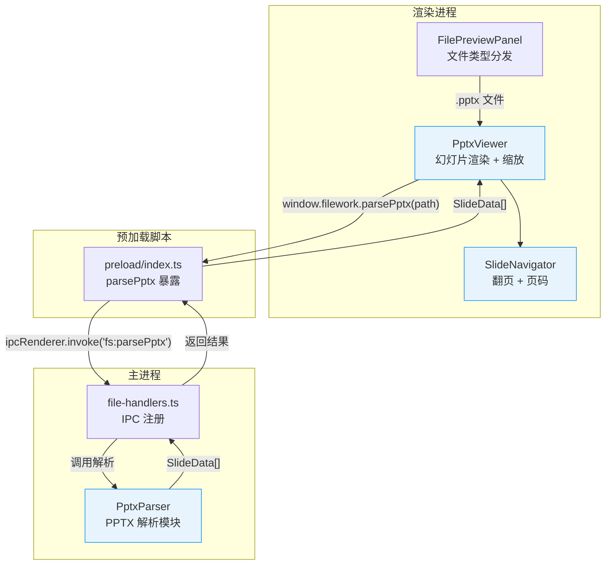
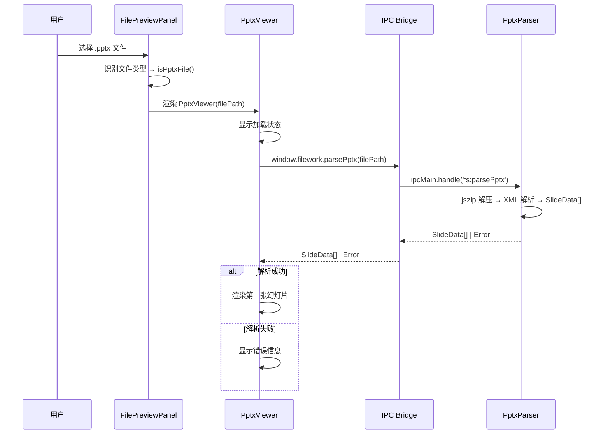

# 设计文档：PPT/PPTX 文件预览

## 概述

为 FileWork 桌面应用的文件预览面板（`FilePreviewPanel`）添加 PPTX 文件预览能力。该功能在现有预览架构（代码/PDF/图片）之上新增 PPTX 分支，遵循以下设计原则：

1. **主进程解析，渲染进程展示**：PPTX 文件在主进程中通过 `jszip` + XML 解析完成，解析结果通过 IPC 传递到渲染进程，与现有 `fs:readFile` / `fs:readFileBase64` 模式一致
2. **按比例 HTML 渲染**：不依赖 canvas 或第三方渲染引擎，使用 CSS absolute positioning + transform scale 将幻灯片元素按原始坐标渲染到 HTML 容器中
3. **最小侵入**：复用现有的缩放控件模式（参考图片预览的 zoom 实现），新增 `PptxViewer` 组件和 `SlideNavigator` 子组件
4. **渐进式支持**：优先支持文本和图片元素的渲染，形状仅渲染为占位矩形；`.ppt` 旧格式给出转换提示

### 技术选型

| 决策 | 选择 | 理由 |
|------|------|------|
| PPTX 解析 | `jszip` + 手动 XML 解析 | PPTX 本质是 ZIP 包含 XML，`jszip` 轻量且项目已有 ZIP 处理经验；避免引入重量级库如 `pptxjs` |
| XML 解析 | Node.js 内置 DOMParser 或 `fast-xml-parser` | 主进程中解析 OOXML，`fast-xml-parser` 轻量高效 |
| 渲染方式 | CSS absolute positioning | 无需 canvas，支持文本选择，与 React 组件模型契合 |
| 单位转换 | EMU → px（1 EMU = 1/914400 inch, 96 DPI） | OOXML 使用 EMU 单位，需转换为像素 |

## 架构



### 数据流



## 组件与接口

### 1. PptxParser 模块 (`src/main/pptx-parser.ts`)

主进程中的 PPTX 文件解析器，负责将 `.pptx` 文件解析为结构化的 `SlideData` 数组。

```typescript
import JSZip from "jszip";
import { XMLParser } from "fast-xml-parser";

/** 解析 PPTX 文件，返回幻灯片数据 */
export async function parsePptx(filePath: string): Promise<SlideData[]>;

/** 从 ZIP 中提取幻灯片 XML 并解析 */
function parseSlideXml(xml: string, rels: RelationshipMap, images: ImageMap): SlideElement[];

/** EMU 单位转换为像素 */
function emuToPx(emu: number): number;

/** 提取文本运行（text run）的格式信息 */
function parseTextRun(rNode: XmlNode): TextRun;

/** 从关系文件中提取图片引用 */
function resolveImageRefs(relsXml: string, zip: JSZip): Promise<ImageMap>;
```

解析策略：
- 使用 `jszip` 读取 `.pptx` 文件（ZIP 格式）
- 解析 `[Content_Types].xml` 获取幻灯片列表
- 按顺序解析 `ppt/slide1.xml` ~ `ppt/slideN.xml`
- 从 `ppt/slide{N}.xml.rels` 获取图片关系映射
- 从 `ppt/media/` 目录提取图片并转为 base64
- 从 `ppt/presentation.xml` 获取幻灯片尺寸（默认 16:9）
- 解析 `ppt/slideLayouts/` 和 `ppt/slideMasters/` 获取背景信息

### 2. PptxViewer 组件 (`src/renderer/components/file-preview/PptxViewer.tsx`)

渲染进程中的幻灯片查看器组件。

```typescript
interface PptxViewerProps {
  filePath: string;
}

export const PptxViewer: React.FC<PptxViewerProps>;
```

职责：
- 调用 `window.filework.parsePptx(filePath)` 获取 `SlideData[]`
- 管理加载/错误/成功三种状态
- 渲染当前幻灯片的所有元素（文本、图片、形状）
- 提供缩放控件（复用现有图片预览的缩放模式）
- 监听键盘左右方向键进行翻页
- 文件切换时重置缩放和页码

### 3. SlideNavigator 组件 (`src/renderer/components/file-preview/SlideNavigator.tsx`)

幻灯片导航控件。

```typescript
interface SlideNavigatorProps {
  currentSlide: number;
  totalSlides: number;
  onPrev: () => void;
  onNext: () => void;
}

export const SlideNavigator: React.FC<SlideNavigatorProps>;
```

职责：
- 显示页码（"第 N 页 / 共 M 页"，国际化）
- 上一页/下一页按钮
- 第一页时禁用上一页，最后一页时禁用下一页

### 4. FilePreviewPanel 修改

在现有 `FilePreviewPanel.tsx` 中新增 PPTX 文件类型识别：

```typescript
// 新增文件类型判断
const isPptxFile = (filename: string): boolean => {
  return getFileExtension(filename).toLowerCase() === ".pptx";
};

const isPptFile = (filename: string): boolean => {
  return getFileExtension(filename).toLowerCase() === ".ppt";
};

// 修改 supported 判断，将 .pptx 纳入支持范围
const isPptx = isPptxFile(fileName);
const isPpt = isPptFile(fileName);
const supported = isSupportedFile(fileName) || isPdf || isImage || isPptx || isPpt;
```

### 5. IPC 通道注册

在 `src/main/ipc/file-handlers.ts` 中新增：

```typescript
ipcMain.handle("fs:parsePptx", async (_event, filePath: string) => {
  const { parsePptx } = await import("../pptx-parser");
  return parsePptx(filePath);
});
```

在 `src/preload/index.ts` 中新增：

```typescript
parsePptx: (path: string) => ipcRenderer.invoke("fs:parsePptx", path),
```

### 6. 国际化文本

在三种语言文件中新增 `pptx` 命名空间的翻译键：

```typescript
// en
pptx_loading: "Parsing presentation...",
pptx_pageInfo: "Slide {current} / {total}",
pptx_unsupportedFormat: "Only .pptx format is supported. Please convert your .ppt file to .pptx.",
pptx_fileTooLarge: "This file is over 100MB and may affect performance. Continue loading?",
pptx_fileTooLargeContinue: "Continue",
pptx_fileTooLargeCancel: "Cancel",
pptx_parseError: "Failed to parse presentation: {reason}",

// zh-CN
pptx_loading: "解析演示文稿中...",
pptx_pageInfo: "第 {current} 页 / 共 {total} 页",
pptx_unsupportedFormat: "仅支持 .pptx 格式，请将 .ppt 文件转换为 .pptx 格式",
pptx_fileTooLarge: "文件超过 100MB，可能影响性能。是否继续加载？",
pptx_fileTooLargeContinue: "继续",
pptx_fileTooLargeCancel: "取消",
pptx_parseError: "解析演示文稿失败：{reason}",

// ja
pptx_loading: "プレゼンテーションを解析中...",
pptx_pageInfo: "スライド {current} / {total}",
pptx_unsupportedFormat: ".pptx 形式のみ対応しています。.ppt ファイルを .pptx に変換してください。",
pptx_fileTooLarge: "ファイルが 100MB を超えています。パフォーマンスに影響する可能性があります。読み込みを続けますか？",
pptx_fileTooLargeContinue: "続行",
pptx_fileTooLargeCancel: "キャンセル",
pptx_parseError: "プレゼンテーションの解析に失敗しました：{reason}",

```

## 数据模型

### SlideData

解析后的单张幻灯片数据结构：

```typescript
interface SlideData {
  /** 幻灯片索引（从 0 开始） */
  index: number;
  /** 幻灯片宽度（像素） */
  width: number;
  /** 幻灯片高度（像素） */
  height: number;
  /** 背景信息 */
  background: SlideBackground;
  /** 幻灯片中的所有元素 */
  elements: SlideElement[];
}

interface SlideBackground {
  /** 背景类型 */
  type: "color" | "image" | "none";
  /** 背景颜色（十六进制，如 "#FFFFFF"） */
  color?: string;
  /** 背景图片 base64 数据 */
  imageBase64?: string;
}

type SlideElement = TextElement | ImageElement | ShapeElement;

interface BaseElement {
  /** 元素 ID */
  id: string;
  /** X 坐标（像素） */
  x: number;
  /** Y 坐标（像素） */
  y: number;
  /** 宽度（像素） */
  width: number;
  /** 高度（像素） */
  height: number;
}

interface TextElement extends BaseElement {
  type: "text";
  /** 文本段落列表 */
  paragraphs: TextParagraph[];
}

interface TextParagraph {
  /** 段落对齐方式 */
  align: "left" | "center" | "right" | "justify";
  /** 文本运行列表 */
  runs: TextRun[];
}

interface TextRun {
  /** 文本内容 */
  text: string;
  /** 字号（磅） */
  fontSize: number;
  /** 是否加粗 */
  bold: boolean;
  /** 是否斜体 */
  italic: boolean;
  /** 文本颜色（十六进制） */
  color: string;
  /** 字体名称 */
  fontFamily: string;
}

interface ImageElement extends BaseElement {
  type: "image";
  /** 图片 base64 数据（含 MIME 前缀） */
  src: string;
}

interface ShapeElement extends BaseElement {
  type: "shape";
  /** 形状类型名称（如 "rect", "ellipse"） */
  shapeType: string;
  /** 填充颜色 */
  fillColor?: string;
  /** 边框颜色 */
  borderColor?: string;
}
```

### ParsePptxResult

IPC 通信的返回类型：

```typescript
type ParsePptxResult =
  | { success: true; slides: SlideData[]; slideWidth: number; slideHeight: number }
  | { success: false; error: string };
```

### 单位转换

OOXML 使用 EMU（English Metric Unit）作为坐标单位：
- 1 inch = 914400 EMU
- 1 pt = 12700 EMU
- 转换公式：`px = emu / 914400 * 96`（96 DPI 屏幕）
- 字号转换：`pt = emu / 12700`（半磅单位需 ÷ 100）

### 新增依赖

| 包名 | 类型 | 用途 |
|------|------|------|
| `jszip` | 生产依赖 | 解压 PPTX（ZIP 格式） |
| `fast-xml-parser` | 生产依赖 | 解析 OOXML 中的 XML 文件 |

> 注：`fast-check` 和 `vitest` 已在项目中作为开发依赖存在。


## 正确性属性

*属性（Property）是在系统所有合法执行中都应成立的特征或行为——本质上是对系统应做什么的形式化陈述。属性是人类可读规格说明与机器可验证正确性保证之间的桥梁。*

### Property 1: PPTX 文件类型识别

*For any* 文件名字符串，当其扩展名为 `.pptx`（不区分大小写）时，`isPptxFile` 函数 SHALL 返回 `true`；当扩展名不是 `.pptx` 时 SHALL 返回 `false`。

**Validates: Requirements 1.1**

### Property 2: 无效文件的错误处理

*For any* 非有效 PPTX 格式的字节序列（随机字节、空文件、损坏的 ZIP），`parsePptx` SHALL 返回 `{ success: false, error: string }` 且 `error` 字符串非空。

**Validates: Requirements 2.6**

### Property 3: EMU 到像素的单位转换一致性

*For any* 非负整数 EMU 值，`emuToPx(emu)` SHALL 等于 `emu / 914400 * 96`，且结果为非负数。此外，对于任意两个 EMU 值 a 和 b，若 `a < b` 则 `emuToPx(a) <= emuToPx(b)`（单调性）。

**Validates: Requirements 2.4, 3.2**

### Property 4: 幻灯片导航边界不变量

*For any* 幻灯片总数 `total`（≥ 1）和当前索引 `current`（0 ≤ current < total），执行 `goNext` 后 `current` SHALL 等于 `min(current + 1, total - 1)`，执行 `goPrev` 后 `current` SHALL 等于 `max(current - 1, 0)`。导航操作永远不会使 `current` 越界。

**Validates: Requirements 4.1, 4.2, 4.3, 4.4, 4.5**

### Property 5: 缩放比例边界不变量

*For any* 当前缩放比例值，执行 `zoomIn` 后缩放比例 SHALL 等于 `min(current + 0.25, 5.0)`，执行 `zoomOut` 后缩放比例 SHALL 等于 `max(current - 0.25, 0.25)`。缩放比例始终在 `[0.25, 5.0]` 范围内。

**Validates: Requirements 5.2, 5.3**

### Property 6: IPC 错误传播完整性

*For any* 由 `PptxParser` 抛出的错误（包含错误消息字符串），通过 IPC 通道传递后，渲染进程收到的错误信息 SHALL 包含原始错误消息的内容。

**Validates: Requirements 6.4**

### Property 7: 文件大小警告阈值

*For any* 文件大小值（字节），当且仅当文件大小超过 `100 * 1024 * 1024`（100MB）时，系统 SHALL 触发大文件警告。

**Validates: Requirements 7.4**

## 错误处理

| 场景 | 处理方式 |
|------|----------|
| `.pptx` 文件不存在或无读取权限 | `PptxParser` 返回 `{ success: false, error: "文件不存在或无法读取" }`，`PptxViewer` 显示错误信息 |
| 文件不是有效的 ZIP 格式 | `PptxParser` 捕获 `jszip` 异常，返回 `{ success: false, error: "文件格式无效，不是有效的 PPTX 文件" }` |
| ZIP 中缺少必要的 XML 文件 | `PptxParser` 返回 `{ success: false, error: "PPTX 文件结构不完整" }` |
| XML 解析失败 | `PptxParser` 捕获 XML 解析异常，返回具体错误信息 |
| 图片资源缺失或损坏 | 跳过该图片元素，在对应位置渲染占位符，不中断整体解析 |
| 文件大小超过 100MB | `PptxViewer` 在调用解析前检查文件大小，显示警告对话框，用户确认后继续 |
| `.ppt` 旧格式文件 | `FilePreviewPanel` 显示格式不支持提示，建议转换为 `.pptx` |
| IPC 通信超时或失败 | `PptxViewer` 捕获 Promise rejection，显示通用错误信息 |
| 幻灯片中包含不支持的元素类型（表格、图表、SmartArt） | 静默跳过，不渲染该元素，不报错 |

## 测试策略

### 测试框架

- **单元测试**：Vitest
- **属性测试**：`fast-check`（已在项目 devDependencies 中）
- 每个属性测试至少运行 100 次迭代

### 属性测试（Property-Based Tests）

| 属性 | 测试文件 | 生成器 |
|------|----------|--------|
| Property 1: 文件类型识别 | `pptx-parser.property.test.ts` | 随机文件名 + 随机扩展名（含 `.pptx` 变体） |
| Property 2: 无效文件错误处理 | `pptx-parser.property.test.ts` | 随机字节数组（非有效 PPTX） |
| Property 3: EMU 单位转换 | `pptx-parser.property.test.ts` | 随机非负整数 EMU 值 |
| Property 4: 导航边界不变量 | `slide-navigator.property.test.ts` | 随机 total（1-1000）+ 随机 current + 随机操作序列 |
| Property 5: 缩放边界不变量 | `pptx-viewer.property.test.ts` | 随机初始缩放值 + 随机 zoomIn/zoomOut 操作序列 |
| Property 6: IPC 错误传播 | `pptx-ipc.property.test.ts` | 随机错误消息字符串 |
| Property 7: 文件大小阈值 | `pptx-viewer.property.test.ts` | 随机文件大小值（0 - 500MB） |

每个属性测试必须包含注释标签：
```typescript
// Feature: pptx-preview, Property 1: PPTX 文件类型识别
```

### 单元测试（Unit Tests）

| 模块 | 测试重点 |
|------|----------|
| PptxParser | 解析包含文本的 PPTX（2.2）、解析包含图片的 PPTX（2.3）、解析背景信息（2.5）、空 PPTX 文件处理 |
| PptxViewer | 加载状态显示（7.1）、成功后显示第一张幻灯片（7.2）、错误状态显示（7.3）、文件切换重置缩放（5.5）、键盘导航（4.6, 4.7） |
| SlideNavigator | 页码格式显示（4.1）、首页禁用上一页（4.4）、末页禁用下一页（4.5） |
| FilePreviewPanel | `.pptx` 文件加载 PptxViewer（1.1）、`.ppt` 文件显示提示（1.2）、支持范围包含 `.pptx`（1.3） |
| IPC | `fs:parsePptx` 通道注册（6.1）、preload 暴露 `parsePptx`（6.2）、请求转发（6.3） |
| i18n | 三种语言翻译键完整性（8.2, 8.3） |

### 测试文件组织

```
src/main/__tests__/
└── pptx-parser.test.ts              # PptxParser 单元测试
└── pptx-parser.property.test.ts     # PptxParser 属性测试

src/renderer/components/file-preview/__tests__/
├── PptxViewer.test.tsx               # PptxViewer 单元测试
├── pptx-viewer.property.test.ts      # PptxViewer 属性测试（缩放、文件大小）
├── SlideNavigator.test.tsx           # SlideNavigator 单元测试
├── slide-navigator.property.test.ts  # SlideNavigator 属性测试（导航）
└── pptx-ipc.property.test.ts         # IPC 错误传播属性测试
```
