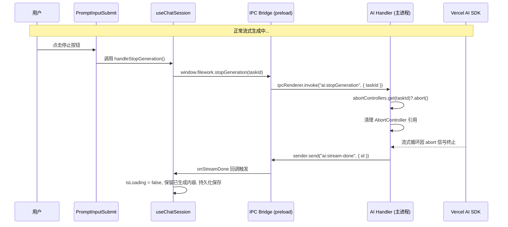
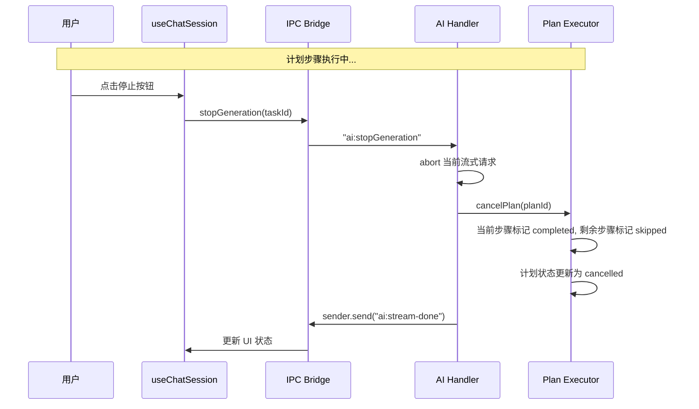

# 技术设计文档：停止 LLM 生成

## 概述

本设计为 FileWork 聊天应用实现"停止 LLM 流式生成"功能。当前架构中，用户发送消息后 LLM 流式生成无法中断，必须等待完成。本功能通过引入 `AbortController` 生命周期管理和新的 IPC 通道，允许用户在流式输出过程中随时中止生成。

### 核心设计决策

1. **基于 AbortController 的中止机制**：利用 Web 标准 `AbortController`，将其 `signal` 传递给 Vercel AI SDK 的 `streamText` 调用，实现底层 HTTP 连接的真正中止，而非仅停止前端渲染。
2. **任务 ID 隔离存储**：使用 `Map<string, AbortController>` 按任务 ID 隔离管理，确保并发安全。
3. **复用现有 IPC 模式**：新增 `ai:stopGeneration` IPC 通道，遵循现有 `ipcMain.handle` / `ipcRenderer.invoke` 模式。
4. **按钮状态复用**：`PromptInputSubmit` 组件已具备 `status` 驱动的图标切换逻辑（方形停止图标 vs 回车发送图标），只需在点击时根据状态分发不同行为。

## 架构

### 数据流



### 计划执行中止流程



## 组件与接口

### 1. AbortController 注册表（主进程）

在 `ai-handlers.ts` 中新增模块级 `Map`：

```typescript
/** 按任务 ID 存储活跃的 AbortController */
const abortControllers = new Map<string, AbortController>();
```

接口：
- `register(taskId: string): AbortSignal` — 创建并存储 AbortController，返回 signal
- `abort(taskId: string): boolean` — 中止指定任务，返回是否找到对应控制器
- `cleanup(taskId: string): void` — 移除已完成任务的控制器引用

### 2. IPC 通道：`ai:stopGeneration`

在 `registerAIHandlers()` 中新增：

```typescript
ipcMain.handle(
  "ai:stopGeneration",
  async (_event, payload: { taskId: string }) => {
    const controller = abortControllers.get(payload.taskId);
    if (controller) {
      controller.abort();
      abortControllers.delete(payload.taskId);
    }
    // 任务 ID 不存在或已完成时，静默返回成功
    return { ok: true };
  }
);
```

### 3. Preload Bridge 扩展

在 `src/preload/index.ts` 的 `api` 对象中新增：

```typescript
stopGeneration: (taskId: string) =>
  ipcRenderer.invoke("ai:stopGeneration", { taskId }),
```

### 4. useChatSession Hook 扩展

新增 `handleStopGeneration` 方法：

```typescript
const handleStopGeneration = useCallback(() => {
  const taskId = streamTaskIdRef.current;
  if (!taskId) return;
  window.filework.stopGeneration(taskId);
}, []);
```

该方法由 Hook 导出，供 ChatPanel 在停止按钮点击时调用。

### 5. PromptInputSubmit 行为变更

当前 `PromptInputSubmit` 已根据 `status` 切换图标，但始终是 `type="submit"`。需要：
- 当 `status` 为 `streaming` 或 `submitted` 时，点击触发 `onStop` 回调而非表单提交
- 新增 `onStop` prop

```typescript
export type PromptInputSubmitProps = HTMLAttributes<HTMLButtonElement> & {
  disabled?: boolean;
  status?: ChatStatus;
  onStop?: () => void;
};
```

### 6. streamText 调用集成 AbortSignal

在 `ai:executeTask` handler 中：

```typescript
const controller = new AbortController();
abortControllers.set(id, controller);

const result = streamText({
  model,
  tools: { ...tools, ...skillTools },
  abortSignal: controller.signal,
  // ... 其他参数
});
```

在 `executePlan` 中同样传递 `abortSignal`。

## 数据模型

### AbortController 注册表

```typescript
// 模块级状态，位于 ai-handlers.ts
const abortControllers = new Map<string, AbortController>();
```

| 键 | 类型 | 说明 |
|---|---|---|
| taskId | `string` | 任务唯一标识（crypto.randomUUID()） |
| value | `AbortController` | 对应的中止控制器实例 |

### IPC 消息格式

```typescript
// 请求
interface StopGenerationRequest {
  taskId: string;
}

// 响应
interface StopGenerationResponse {
  ok: boolean;
}
```

### 状态变更

停止操作触发以下状态变更：

| 场景 | 任务状态 | isLoading | 消息内容 |
|---|---|---|---|
| 普通流式中止 | completed | false | 保留已生成文本和工具调用 |
| 计划步骤中止 | cancelled | false | 当前步骤 completed，剩余 skipped |
| 任务 ID 不存在 | 无变更 | 无变更 | 无变更 |
| 空消息中止 | completed | false | 保留空消息 |

## 正确性属性

*正确性属性是在系统所有有效执行中都应成立的特征或行为——本质上是关于系统应该做什么的形式化陈述。属性是人类可读规范与机器可验证正确性保证之间的桥梁。*

### 属性 1：中止操作查找与执行

*对于任意*已注册的任务 ID，调用 `stopGeneration(taskId)` 应当找到对应的 AbortController 并调用其 `abort()` 方法，使得 `controller.signal.aborted` 为 `true`。

**验证需求：1.1, 1.2, 3.2**

### 属性 2：中止后任务状态一致性

*对于任意*被中止的流式任务，中止完成后任务状态应为 `"completed"`，已生成的文本内容应被保存到任务记录中，且 `"ai:stream-done"` 事件应被发送到渲染进程。

**验证需求：1.3, 1.4**

### 属性 3：计划中止后步骤状态标记

*对于任意*包含 N 个步骤的计划，若在第 K 步执行时被中止，则第 K 步状态应为 `"completed"`，第 K+1 到第 N 步状态应为 `"skipped"`，且整体计划状态应为 `"cancelled"`。

**验证需求：2.1, 2.2, 2.3**

### 属性 4：按钮状态驱动渲染

*对于任意* `ChatStatus` 值，当 `status` 为 `"streaming"` 或 `"submitted"` 时，按钮应渲染方形停止图标且 `aria-label` 为 `"停止生成"`；当 `status` 为 `"ready"` 或 `"error"` 时，按钮应渲染回车发送图标且 `aria-label` 为 `"Send"`。

**验证需求：4.1, 4.2, 4.4**

### 属性 5：中止后内容保留完整性

*对于任意*已部分生成的助手消息（包含任意文本片段和工具调用结果的组合），中止流式生成后，消息中所有已接收的文本和工具调用结果应完整保留，`isLoading` 应为 `false`，且对话历史应被持久化保存。

**验证需求：5.1, 5.2, 5.3**

### 属性 6：AbortController 生命周期一致性

*对于任意*流式任务序列，每个任务开始时 AbortController 注册表大小增加 1，任务结束（无论正常完成、被中止或异常终止）后注册表大小减少 1。在所有任务完成后，注册表应为空。

**验证需求：6.1, 6.2, 6.4**

## 错误处理

| 场景 | 处理方式 |
|---|---|
| 任务 ID 不存在 | `stopGeneration` 静默返回 `{ ok: true }`，不抛出错误（需求 3.3） |
| 流式已自然结束时收到中止信号 | AbortController 已被清理，`Map.get()` 返回 `undefined`，静默忽略（需求 7.1, 7.3） |
| 网络错误导致流式异常终止 | catch 块中清理 AbortController 引用，发送 `ai:stream-error` 事件（需求 6.4） |
| abort 后 `for await` 循环抛出 AbortError | 在 catch 中检测 `error.name === 'AbortError'`，视为正常中止而非错误，走 completed 路径 |
| sender（WebContents）已销毁 | 发送事件前检查 `sender.isDestroyed()`，已有此模式 |
| 中止时助手消息为空 | 保留空消息，不删除（需求 5.4） |

### AbortError 处理模式

```typescript
try {
  for await (const part of result.fullStream) {
    // ... 处理流式数据
  }
} catch (error: unknown) {
  if (error instanceof Error && error.name === "AbortError") {
    // 用户主动中止，视为正常完成
    updateTask(id, { status: "completed", result: fullText, completedAt: new Date().toISOString() });
    if (!sender.isDestroyed()) sender.send("ai:stream-done", { id });
    return { id, status: "completed" };
  }
  // 其他错误走原有错误处理路径
  throw error;
} finally {
  abortControllers.delete(id);
}
```

## 测试策略

### 双重测试方法

本功能采用单元测试与属性测试相结合的方式：

- **单元测试**：验证具体示例、边界情况和错误条件
- **属性测试**：验证跨所有输入的通用属性

### 属性测试配置

- **测试库**：使用 [fast-check](https://github.com/dubzzz/fast-check) 作为 TypeScript 属性测试库
- **迭代次数**：每个属性测试最少运行 100 次
- **标签格式**：`Feature: stop-llm-generation, Property {N}: {属性描述}`
- 每个正确性属性由单个属性测试实现

### 单元测试覆盖

| 测试类别 | 测试内容 |
|---|---|
| IPC 通道存在性 | `stopGeneration` 方法在 preload API 中可用（需求 3.1） |
| 停止按钮点击行为 | 点击停止状态按钮调用 `handleStopGeneration` 而非提交表单（需求 4.3） |
| 无障碍标签 | 停止状态下 `aria-label` 为 `"停止生成"`（需求 4.4） |
| 空消息保留 | 中止时助手消息为空，消息不被删除（需求 5.4） |
| 竞态条件安全 | 对已完成任务调用 stop 不产生错误（需求 7.1, 7.3） |
| 不存在的任务 ID | 传入无效 ID 返回 `{ ok: true }`（需求 3.3） |

### 属性测试覆盖

| 属性 | 测试描述 |
|---|---|
| 属性 1 | 生成随机任务 ID，注册后调用 abort，验证 signal.aborted 为 true |
| 属性 2 | 生成随机部分文本，模拟中止，验证任务状态和事件发送 |
| 属性 3 | 生成随机步骤数 N 和中止位置 K，验证步骤状态分布 |
| 属性 4 | 生成随机 ChatStatus 值，验证图标和 aria-label 对应关系 |
| 属性 5 | 生成随机消息部分（文本+工具调用组合），模拟中止，验证内容完整保留 |
| 属性 6 | 生成随机任务序列（混合正常完成和中止），验证注册表最终为空 |
