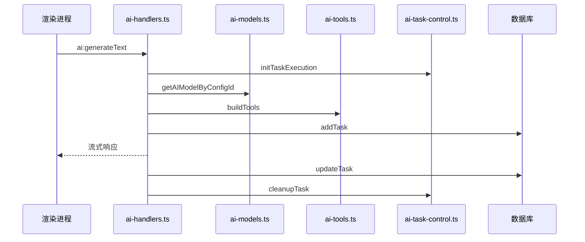
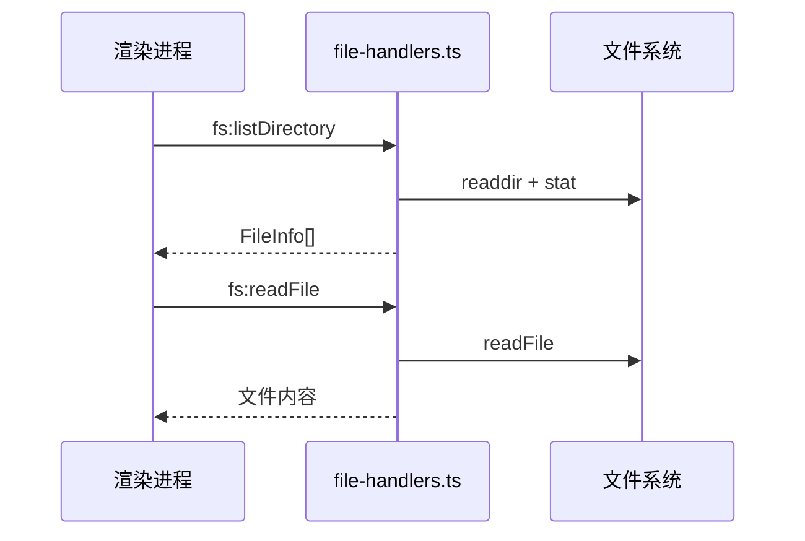

# IPC 处理器模块架构文档

本目录包含 Workspace Agent 应用程序的所有 IPC (Inter-Process Communication) 处理器，负责主进程和渲染进程之间的通信。

## 📋 模块概览

| 文件名 | 主要功能 | 依赖关系 | 状态 |
|--------|----------|----------|------|
| `ai-handlers.ts` | 🤖 AI 核心处理器 | 依赖所有AI子模块 | ✅ 活跃 |
| `ai-plan-handlers.ts` | 📋 AI 计划执行 | ai-models, ai-tool-permissions | ✅ 活跃 |
| `ai-models.ts` | 🔧 AI 模型配置 | 数据库 | ✅ 活跃 |
| `ai-tools.ts` | 🛠️ AI 工具定义 | ai-task-control | ✅ 活跃 |
| `ai-task-control.ts` | ⚡ 任务状态管理 | 无依赖 | ✅ 活跃 |
| `ai-tool-permissions.ts` | 🔐 工具权限管理 | ai-tools, ai-task-control | ✅ 活跃 |
| `chat-handlers.ts` | 💬 聊天会话管理 | 数据库 | ✅ 活跃 |
| `file-handlers.ts` | 📁 文件系统操作 | Node.js fs | ✅ 活跃 |
| `workspace-handlers.ts` | 🏠 工作区管理 | 数据库, 技能系统 | ✅ 活跃 |
| `settings-handlers.ts` | ⚙️ 应用设置 | 数据库 | ✅ 活跃 |
| `llm-config-handlers.ts` | 🤖 LLM 配置管理 | 数据库 | ✅ 活跃 |

## 🏗️ 架构设计

### 核心架构模式

```
渲染进程 (Renderer)
    ↕️ IPC 通信
主进程 IPC 处理器 (Main Process)
    ↕️ 数据层交互
数据库 / 文件系统 / AI 服务
```

### 模块层级关系

```
ai-handlers.ts (顶层协调器)
├── ai-plan-handlers.ts (计划执行)
├── ai-models.ts (模型配置)
├── ai-task-control.ts (状态管理)
├── ai-tool-permissions.ts (权限控制)
└── ai-tools.ts (工具实现)

独立模块:
├── chat-handlers.ts
├── file-handlers.ts
├── workspace-handlers.ts
├── settings-handlers.ts
└── llm-config-handlers.ts
```

## 📚 详细模块说明

### 🤖 AI 核心模块

#### `ai-handlers.ts` - AI 核心处理器
**作用**: 主要的 AI 交互入口点，协调所有 AI 相关功能
- **核心功能**:
  - 流式文本生成 (`ai:generateText`)
  - 技能执行协调
  - 系统提示构建
  - 消息历史管理
- **关键依赖**: 依赖所有其他 AI 子模块
- **设计模式**: 门面模式 (Facade Pattern)

#### `ai-plan-handlers.ts` - AI 计划执行处理器
**作用**: 处理复杂任务的计划生成、审批和执行
- **核心功能**:
  - 计划生成 (`ai:generatePlan`)
  - 计划审批 (`ai:approvePlan`)
  - 计划执行 (`ai:executePlan`)
  - 计划取消 (`ai:cancelPlan`)
- **状态管理**: 维护 `pendingPlans` 映射表

#### `ai-models.ts` - AI 模型配置管理器
**作用**: 统一管理不同 AI 提供商的模型实例化
- **支持的提供商**:
  - OpenAI (包括自定义端点)
  - Anthropic Claude
  - DeepSeek
  - Ollama (本地部署)
- **核心函数**:
  - `getAIModelByConfigId()` - 根据配置ID获取模型实例
  - `isAuthError()` - 检测认证错误

#### `ai-tools.ts` - AI 工具定义和实现
**作用**: 定义 AI 可用的工具集合及其执行逻辑
- **安全工具** (无需审批):
  - `listDirectory` - 目录列表
  - `readFile` - 文件读取
  - `runCommand` - 命令执行
  - `incrementalScan` - 增量扫描
- **危险工具** (需要审批):
  - `writeFile` - 文件写入
  - `moveFile` - 文件移动
  - `deleteFile` - 文件删除
- **审批机制**: `requestApproval()` 函数处理用户审批

#### `ai-task-control.ts` - 任务状态管理器
**作用**: 管理并发 AI 任务的生命周期和状态
- **核心数据结构**:
  - `abortControllers` - 任务中止控制器
  - `manualStopFlags` - 手动停止标志
  - `activeToolExecutions` - 活跃工具执行
  - `pendingApprovals` - 待审批队列
  - `toolCallToTaskMap` - 工具调用映射
- **核心功能**:
  - `initTaskExecution()` - 初始化任务追踪
  - `cleanupTask()` - 清理任务资源
  - `stopTaskExecution()` - 停止任务执行

#### `ai-tool-permissions.ts` - 工具权限管理器
**作用**: 基于技能配置构建受限的工具集合
- **权限控制**: 根据技能的 `allowed-tools` 配置限制可用工具
- **核心函数**:
  - `buildTools()` - 构建完整工具集
  - `buildSkillSpecificTools()` - 构建技能专用工具集

### 💬 聊天和会话模块

#### `chat-handlers.ts` - 聊天会话管理
**作用**: 管理聊天会话的创建、更新、删除和消息历史
- **会话操作**:
  - `chat:createSession` - 创建新会话
  - `chat:getSessions` - 获取会话列表
  - `chat:updateSession` - 更新会话信息
  - `chat:deleteSession` - 删除会话
- **消息操作**:
  - `chat:getHistory` - 获取消息历史
  - `chat:saveHistory` - 保存消息历史

### 📁 文件系统模块

#### `file-handlers.ts` - 文件系统操作
**作用**: 提供安全的文件系统访问接口
- **核心功能**:
  - `fs:listDirectory` - 目录列表（带过滤）
  - `fs:readFile` - 文本文件读取
  - `fs:readFileBase64` - 二进制文件读取
  - `fs:directoryStats` - 目录统计信息
- **安全特性**:
  - 自动跳过隐藏文件和 `node_modules`
  - 权限错误处理

### 🏠 工作区管理模块

#### `workspace-handlers.ts` - 工作区管理
**作用**: 管理最近使用的工作区和技能刷新
- **核心功能**:
  - `workspace:getRecent` - 获取最近工作区
  - `workspace:addRecent` - 添加最近工作区
  - `workspace:removeRecent` - 移除工作区
- **集成特性**: 自动刷新项目级技能

### ⚙️ 配置管理模块

#### `settings-handlers.ts` - 应用设置管理
**作用**: 管理应用程序的全局设置
- **功能**:
  - `settings:get` - 获取单个设置
  - `settings:set` - 设置单个值
  - `settings:getAll` - 获取所有设置

#### `llm-config-handlers.ts` - LLM 配置管理
**作用**: 管理 LLM 提供商配置和验证
- **功能**:
  - `llm-config:list` - 列出所有配置
  - `llm-config:create` - 创建新配置
  - `llm-config:update` - 更新配置
  - `llm-config:delete` - 删除配置
- **验证**: 提供商特定的配置验证逻辑


## 🔄 数据流和交互模式

### 典型的 AI 交互流程



### 文件操作流程



## 🚀 使用建议和最佳实践

### 1. 错误处理
- 所有 IPC 处理器都应该有完整的 try-catch
- 使用统一的错误响应格式：`{ error: string }`

### 2. 资源管理
- AI 任务必须通过 `ai-task-control` 管理生命周期
- 及时清理 AbortController 和相关资源

### 3. 安全考虑
- 危险操作必须通过审批机制
- 文件系统操作有内置的安全过滤
- API 密钥验证和错误处理

### 4. 性能优化
- 使用增量扫描减少文件系统开销
- 流式响应提高用户体验
- 合理的缓存策略

### 5. 扩展指南
- 新增工具应在 `ai-tools.ts` 中定义
- 复杂功能考虑拆分为独立处理器
- 遵循现有的模块化模式

## 🔧 调试和故障排除

### 常见问题
1. **AI 响应卡顿**: 检查 `abortControllers` 状态
2. **工具执行失败**: 查看权限配置和审批状态
3. **文件操作错误**: 确认路径有效性和权限

### 日志策略
- 核心操作有 console.log 输出
- 错误信息包含上下文
- 任务状态变化有追踪日志

---

**维护说明**: 本文档应随代码变更同步更新。如有疑问，请参考各模块的内联注释和类型定义。